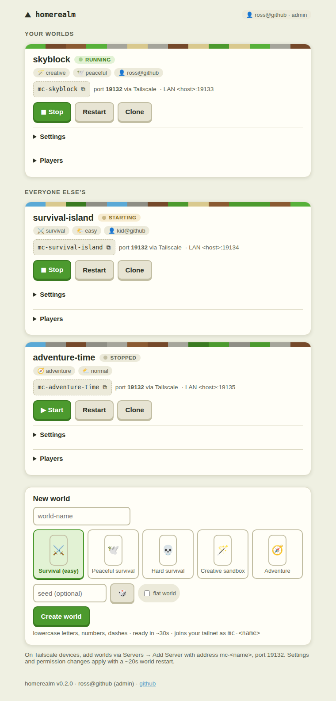

# 🏔 homerealm

**A self-hosted, Realm-style panel for Minecraft Bedrock worlds — Tailscale-
native, built for Synology NAS, works anywhere Docker runs.**



Run as many always-on Bedrock worlds as you like on hardware you own, and
reach them from anywhere on your [tailnet](https://tailscale.com). The panel
itself is a [tsnet](https://tailscale.com/kb/1244/tsnet) application: it joins
your tailnet as its own node (`homerealm`) with automatic HTTPS — no
tailscaled needed on the host, no ports to forward. Every world you create is
automatically wrapped in a Tailscale sidecar and appears on your tailnet as
its own machine (`mc-<name>`), answering on the default Bedrock port. Add
`mc-skyblock` once on a phone or laptop and it works at home, at grandma's,
on hotel wifi.

Manage worlds from a phone-friendly web panel: create from presets or seeds,
clone them, tune settings, grant kids (or revoke cousins) permissions, stop
idle worlds to save RAM, and delete without fear — worlds archive instead of
disappearing. On your home network, worlds can also **appear automatically
under "LAN Games"** on iPads, consoles, and phones — no addresses to type.

Each world runs as its own container of the excellent
[itzg/minecraft-bedrock-server](https://github.com/itzg/docker-minecraft-bedrock-server).
homerealm is a thin management layer: one JSON manifest, one generated
compose file, one small Go binary. No database, no accounts, no cloud.

## Features

- **Tailscale-native** — the panel is a tsnet node (`https://homerealm.<tailnet>.ts.net`);
  each world is its own tailnet machine `mc-<name>` on the default port
  19132, wrapped automatically in a
  [tailscale/tailscale](https://hub.docker.com/r/tailscale/tailscale) sidecar
- **One world = one server** — switching worlds is just picking a different
  server on your device; worlds hold state whether anyone's online or not
- **Create** from presets (Survival easy/peaceful/hard, Creative sandbox,
  Adventure), with optional seed and flat-world toggle
- **Clone** any world — settings, builds, and permissions included (the copy
  gets its own fresh tailnet identity)
- **Settings** per world: mode, difficulty, cheats, max players, view
  distance, default permission for new players
- **Player permissions**: everyone who has ever joined is listed by gamertag
  (auto-harvested from server logs); promote to operator or demote to
  visitor from a dropdown
- **Start / stop / restart** — stopped worlds keep their data, free their
  RAM, and stay stopped across reboots
- **Delete = archive** — worlds move to `_archive/` with a timestamp
- **LAN auto-discovery** (optional): each world gets its own LAN IP via
  macvlan, so all of them show up under "LAN Games" for consoles and other
  devices that can't run Tailscale
- **Auto version match**: worlds run `VERSION: LATEST`; when the Minecraft
  app updates, hit Restart and the server re-downloads to match
- **CLI companion** (`cli/mc-world`) for terminal folks — a thin client of
  the panel's JSON API

## Requirements

- Docker + Docker Compose (on Synology: the **Container Manager** package)
- SSH access with sudo (Synology: enable in Control Panel → Terminal & SNMP)
- A free [Tailscale](https://tailscale.com) account, with the Tailscale app
  on the devices you play from ([MagicDNS](https://tailscale.com/kb/1081/magicdns)
  on for nice names, HTTPS certificates on for a padlocked panel)
- Players need Microsoft/Xbox accounts (standard Bedrock multiplayer)

## Quick start

```bash
git clone https://github.com/rosskukulinski/homerealm.git
cd homerealm
./setup.sh          # first run creates .env — edit it, then:
./setup.sh          # creates data dir (+ macvlan if enabled), builds, starts
```

`.env` essentials:

| Variable | What it is |
|---|---|
| `TS_AUTHKEY` | Tailscale auth key — make it **Reusable** (and ideally Pre-approved, tagged e.g. `tag:homerealm`) at [admin/settings/keys](https://login.tailscale.com/admin/settings/keys) |
| `TS_HOSTNAME` | The panel's tailnet name (default `homerealm`) |
| `HOST_DATA_DIR` | Where world data lives on the host |
| `PUID` / `PGID` | Owner for world files — run `id` to find yours |
| `PANEL_LISTEN_LAN` | Also serve the panel as plain HTTP on the LAN (default `true`) |
| `DISCOVERY_ENABLED` | LAN auto-discovery via macvlan (read below first) |

Open `https://homerealm.<your-tailnet>.ts.net` (or `http://<your-nas>:8090`
on the LAN) and create your first world. On devices, add it via
**Play → Servers → Add Server** with address `mc-<name>` and port `19132`.

## How the Tailscale wrapping works

- **The panel** embeds Tailscale via tsnet. Its node state lives in
  `<data>/_tailscale/panel/`; it logs in with `TS_AUTHKEY` on first start
  (or prints a login URL to `docker logs homerealm` if the key is empty) and
  serves HTTP on the tailnet plus HTTPS with automatic Tailscale certs.
- **Each world** gets two containers in the generated compose file: a
  `ts-<name>` sidecar running `tailscale/tailscale` (the world's tailnet
  node, state in `<data>/_tailscale/<name>/`) and the `mc-<name>` Bedrock
  server sharing the sidecar's network namespace
  (`network_mode: service:`). Tailnet traffic to `mc-<name>:19132/udp`
  lands directly on the server — every world on the same, default port.
- **Auth keys**: the key is passed to sidecars via compose environment
  interpolation, never written to disk. Once a node has logged in, its
  identity persists in its state dir — an expired key only affects *new*
  worlds, so rotate the key in `.env` whenever it lapses.
- **Deleting a world** archives its data and drops its tailnet state; the
  stale `mc-<name>` machine can be removed in the
  [admin console](https://login.tailscale.com/admin/machines).
- Stopping a world stops the Bedrock server but leaves its sidecar (a few MB
  of RAM) connected, so the node stays visible on the tailnet.

Consoles (Xbox, Switch, PlayStation) can't run Tailscale — for those, use
LAN auto-discovery below when at home, or a
[subnet router](https://tailscale.com/kb/1214/site-to-site) if you're
adventurous.

## LAN auto-discovery (optional)

Bedrock clients only auto-discover servers on the **default port (19132) via
subnet broadcast** — so multiple port-mapped worlds can never all appear in
"LAN Games". homerealm solves this by giving each world its own LAN IP
(Docker macvlan), all answering on 19132.

Before enabling `DISCOVERY_ENABLED=true`:

1. **Reserve a few LAN IPs outside your DHCP pool** (e.g. shrink your pool to
   end at `.249`, use `.250–.254` for worlds). Collisions cause weird pain.
2. Know your host's LAN interface (`ip -br addr` — e.g. `eth0`, `bond0`; on
   Synology with Open vSwitch it's `ovs_bond0` / `ovs_eth0`).
3. Run `./setup.sh` — it creates the macvlan network interactively.

Note: macvlan means the *host itself* can't reach the world IPs (kernel
isolation) — devices on the LAN can. That's fine for normal use.

## Friends without Tailscale

The generous path is [sharing your nodes](https://tailscale.com/kb/1084/sharing):
share `mc-<name>` to a friend's tailnet and they connect like you do. For
the VPN-averse, a tunnel like playit.gg works; if you instead port-forward,
**enable the allow-list** for that world — homerealm sets
`ALLOW_LIST: "false"` by default, which is right for LAN/tailnet and wrong
for the open internet.

## Security model

The panel has **no login of its own** — your tailnet is the front door.
Anyone who can reach it can start/stop/delete worlds, so scope access with
[Tailscale ACLs](https://tailscale.com/kb/1018/acls) (the panel shows who's
connected via Tailscale identity in the footer). `PANEL_LISTEN_LAN=true`
additionally exposes plain HTTP on your LAN for the CLI and non-Tailscale
devices at home; set it `false` for tailnet-only. **Never port-forward the
panel.** (The archive-on-delete design limits the blast radius of curious
children.)

## CLI

```bash
cp cli/mc-world /usr/local/bin/ && chmod +x /usr/local/bin/mc-world
mc-world list
mc-world new skyblock creative
mc-world stop skyblock
# from another tailnet machine:
MC_PANEL_URL=http://homerealm mc-world list
```

## Troubleshooting

- **World never appears on the tailnet** — check `docker logs ts-<name>`;
  an expired/single-use `TS_AUTHKEY` is the usual cause. Put a fresh
  reusable key in `.env` and restart the sidecar.
- **Panel unreachable on the tailnet** — `docker logs homerealm`; with no
  `TS_AUTHKEY` set it prints a login URL you can open once instead.
- **"You're not invited to play on this server"** — recent Bedrock versions
  ship with the allow-list enabled by default; homerealm disables it, but a
  hand-made world may not have it set. Check the world's `server.properties`.
- **Can't join after a Minecraft app update** — Restart the world; it
  re-downloads the matching server version.
- **Synology: containers crash-loop with permission errors** — DSM's ACLs
  can make POSIX modes lie. Fix ownership from *inside* a container:
  `docker run --rm -v /your/data:/d alpine chown -R <PUID>:<PGID> /d`
- **Settings apply but nothing changes** — if you run compose by hand, use
  the project name `-p homerealm-worlds`, or you'll orphan the containers.
- **Child account can't join anything** — enable "join multiplayer games"
  in Xbox family settings.

## Credits

- [itzg/docker-minecraft-bedrock-server](https://github.com/itzg/docker-minecraft-bedrock-server)
  does the heavy lifting of running Bedrock in a container. Consider
  [supporting itzg](https://github.com/sponsors/itzg).
- [Tailscale's tsnet](https://tailscale.com/kb/1244/tsnet) makes "just put
  it on the tailnet" a library call.

## License

[MIT](LICENSE)
